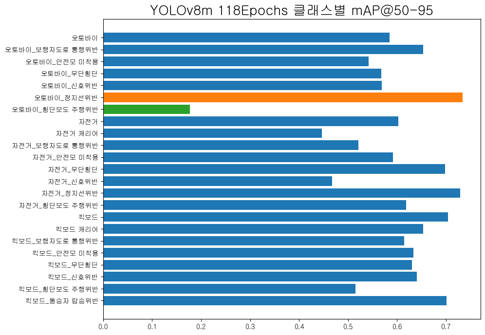

# AIB 18기 Team Project2 레포입니다.
* 팀명 : 다!잡아
* 팀원 : 손효은, 박준서, 박경훈, 조현식
* 주제 : 교통법규 위반 탐지 (Object Detection)

## 역할
손효은 : 팀장, 프론트엔드, 모델링
박준서 : 백엔드, 모델링
박경훈 : 모델링 중점, git
조현식 : 모델링 중점, 유관기관(경찰청) 의견 수집

---
## 프로젝트 요약

### 프로젝트 동기
* [AI hub의 개인형 이동장치 안전데이터](https://aihub.or.kr/aihubdata/data/view.do?currMenu=115&topMenu=100&dataSetSn=614) 를 사용하여 교통법규 위반을 탐지 하고자 합니다.
* 현재 한국은 킥보드, 자전거, 오토바이등의 개인형이동장치(PM)의 교통법규위반 및 사고사례가 꾸준히 증가하고 있지만, 이를 단속하거나 예방할 수 있는 여건은 부족한 실정입니다. 
* 따라서, 본 프로젝트의 목표는 순찰차에 설치되어있는 **블랙박스 혹은 카메라 장비를 활용하여 실시간으로 위반을 자동 탐지**하여 단속하거나 예방할 수 있도록 하는것입니다.
 

### 모델선정 및 학습
* mmdetection, ultralytics 두개의 프레임워크를 사용하여 7개모델을 학습
    * mmdetection : Faster-RCNN, RTMDet, YOLOv3mobile
    * ultralytics : YOLOv8 (n, s, m), RT-DETR-l
* 이때 mmdetection을 사용한 모델들은 학습속도 이슈로 드랍하였으며, YOLOv8과 RT-DETR중에 **최종적으로 YOLOv8m 선정**
* YOLOv8m은 기본 78epoch에서 블랙박스 영상 일반화 성능을 튜닝하기위해 하이퍼파라미터를 변경하여 40epoch 추가학습 (총 118epoch), agnostic-NMS 적용
    * 추가학습으로 탐지 일관성 상승
    * 대형 객체 탐지성능 상승
    * 하나의 객체 다중클래스 탐지문제 해결  
 

**탐지성능 비교**

 

**검증 성능**  
* mAP@50&nbsp;&nbsp;&nbsp;&nbsp;&nbsp;&nbsp;: 0.782
* mAP@75&nbsp;&nbsp;&nbsp;&nbsp;&nbsp;&nbsp;: 0.714
* mAP@50-95&nbsp;: 0.591
* 클래스별 성능  

 

### 모델배포
* 현재 웹용 ONNX cpu버전만 배포완료
    * 추후 필요시 TensorRT로 배포도 가능
* ONNX Runtime 사용시 **추론시간 : 장당 3~500ms**
 

### 웹 구성
<!-- 작성요망! -->

---
## Requirements
* python = 3.11.3
* PyTorch = 2.0.1+cu118
* TorchVision = 0.15.2+cu118
* numpy = 1.25.2
* tensorboard = 2.14.0
* ultralytics = 8.0.159
* MMdetection = 3.0.1
* onnxruntime = 1.15.1
* psycopg2-binary = 2.9.7
* flask = 2.3.3
* gunicorn = 21.2.0
* redis = 